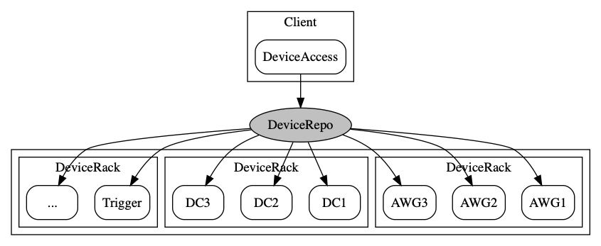

# Device Repo

Access devices in a distributed, multi-users environment.

## Features

- Access devices remotely. E.g. Device runs on PC1, while users' scripts on PC2 are able to
invoke that device.
- Native feel. The process of networking and connection management is opaque to users, he can
use the device like it is a local object.
- Avoid conflict. One device can only be acquired by only one user at one time.



## Install

1. Clone or download this repo. Open a new terminal window (PowerShell on Windows) and
`cd` to the path of device_repo you have cloned/downloaded. Activate _anaconda_ if you use anaconda.

1. Install python pacakge in a **virtual environment** is strongly encouraged.
Create a virtual environment(called `venv`) by
```bash
python -m venv venv
```

2. Install device_repo to `venv` by
```bash
venv/bin/python device_repo/setup.py install
```

## Usage

1. On the host PC: start the device repo host.
```bash
venv/bin/devicerepo
```
   By default, it will listen on port 20201.
   
1. On the PC which devices are connected to: start the device rack.
```bash
venv/bin/python racks/dummy_rack.py -h 127.0.0.1
```
   where 127.0.0.1 is the ip address of the host PC.
   
1. Access the device on user's PC. In the python script:
```python
from device_repo.access import DeviceRepoAccess
access = DeviceRepoAccess("127.0.0.1", "20201") 
device = access.get_device("Dummy01")
data = device.get_data()
print(data)
access.release_device("Dummy01")
```

## Develop

These sections are prepared for people interested in how _device repo_ works and
would to get involved in debugging, maintaining or enhancing it.

### Prepare development environment

_device repo_ is initially developed under *nix environment. Windows users should
consider install _Mingw_ or _Cygwin_ to get a set of tools frequently used on *nix
environment.

To test any changes conveniently, one should install device_repo in _development_
mode, i.e.
```bash
venv/bin/python device_repo/setup.py develop
```

### Compile ICE slices into python scripts

The whole device_repo is based on ZeroC ICE, a RPC framework widely used in industry.
It provides everything one needs to do RPC. RPC interface is defined by _slice_ files
(as in device_repo/slices/). They need to be converted into python scripts beforehand.

A `Makefile` has been provided to wrap up all these nuance (you may have already
notice some tricky substitutions happen in the Makefile). In order to get it work,
make sure you have _Mingw_ or _Cygwin_ installed **and the `PATH` environment variable
is properly set to include its bin/ folder**.

Then on your PowerShell, type
```bash
make
```
and everything is done for you.

### Tests

Some tests are prepared to ensure device_repo runs on our expectation. To run these tests,
simply by
```bash
make test
```
or call
```bash
python -m pytest tests/test_dummy.py
```
if you have pytest installed.

Please be note that these tests are for device_repo itself, not includes racks for
individual devices. You have to tests all racks by yourself.

### Add new devices into device_repo

Study `device_repo/slices/AWG.ice` and `Dummy.ice` to learn how to write a slice file.
These slice files defined the interface of a device (AWG and a _Dummy_ device).
The best way to start is make a copy of one of them and modify its content.

Then look into `racks/dummy_rack.py` and `racks/keysight_sd1_rack.py`. So you will
learn how to write a _rack_.

Notice that if you don't want to add a brand new category of devices but merely
another AWG, you don't have to change the device interface. What you need is just
a new _rack_ to host them. **The whole point is though devices may come from 
different vendors, their functionalities are basically the same so the interface 
should also be the same. It is your responsibility to warp them into the same 
interface.**

Bad practices include writing two different interface for two devices of the same
kind.
